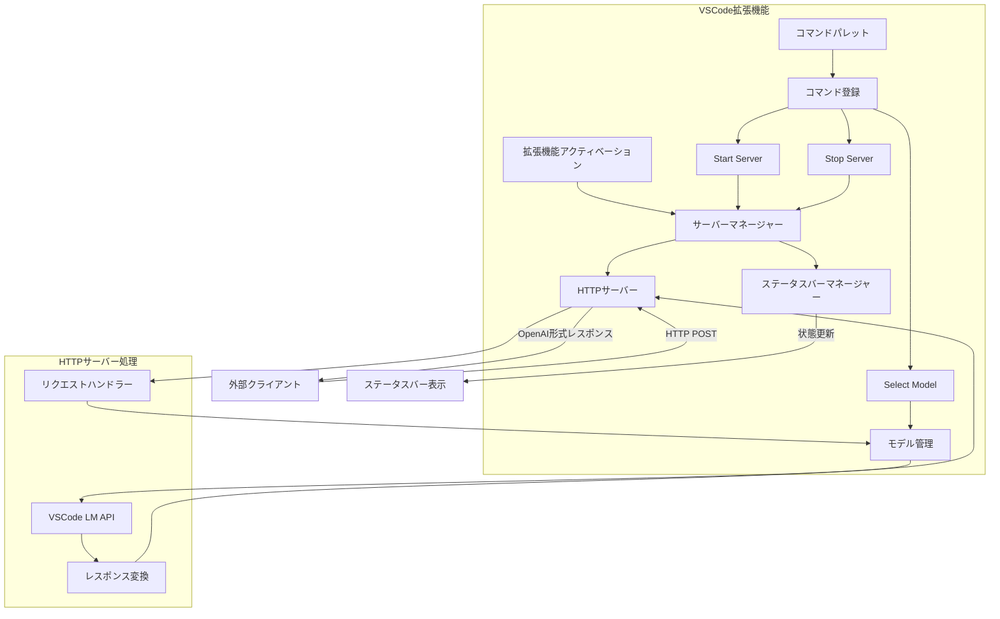

# VSCode LM API Proxy拡張機能の実装計画

## 概要
この拡張機能は、VSCodeのLanguage Model APIをHTTPエンドポイントとして公開し、外部ツールからのアクセスを可能にします。OpenAI API互換のインターフェースを提供し、VSCode外部のアプリケーションからVSCodeのLLM機能を利用できるようにします。

## アーキテクチャ



## コンポーネント詳細

### 1. コマンドパレット統合
- サーバー制御コマンド
  - `vscode-lm-proxy.startServer`: サーバーの起動
  - `vscode-lm-proxy.stopServer`: サーバーの停止
- モデル管理コマンド
  - `vscode-lm-proxy.selectModel`: 使用するモデルの選択
- キーバインディングのサポート

### 2. サーバーマネージャー
- サーバーの起動/停止を制御
- 現在の状態を管理（起動中/停止中）
- ポート4000での待ち受け
- エラー状態の管理と通知

### 3. ステータスバー機能
- サーバーの現在の状態を表示
  - 起動中: 緑色のインジケータ
  - 停止中: 赤色のインジケータ
  - エラー状態: 警告アイコン
- クリックでのコマンドメニュー表示
- エラー発生時のメッセージ表示

### 4. モデル選択機能
- 利用可能なLanguage Modelの一覧表示
  - `vscode.lm.selectChatModels()` を使用してモデル情報を取得
  - サポート対象モデルファミリー（gpt-4o, gpt-4o-mini, o1, o1-mini, claude-3.5-sonnet等）を指定可能に
- クイックピックを使用したモデル選択UI
  - モデル名、ベンダー、トークン上限などの情報を表示
- モデル選択状態の保持
  - 選択モデルのIDと設定の保存
  - 拡張機能再起動時の状態復元
- モデル選択エラーハンドリング
  - モデル利用不可時の代替処理
  - ユーザー同意が得られなかった場合の処理

### 5. VSCode LM APIとOpenAI API形式の変換
- リクエスト変換処理
  - OpenAI API形式のリクエストをVSCode LM API形式に変換
  - メッセージ形式の変換（`LanguageModelChatMessage`の適切な使用）
  - モデルパラメータのマッピング
- レスポンス変換処理
  - ストリーミングレスポンスの処理
  - レスポンスのOpenAI API形式への変換
  - エラーのマッピング（VSCode `LanguageModelError`からOpenAI APIエラー形式へ）
- トークン制限の管理
  - モデルごとのトークン上限の考慮（例：gpt-4oの64K制限）
  - 必要に応じたコンテキスト切り詰め
- レート制限対策
  - リクエスト数の追跡
  - スロットリングの実装
  - エラー発生時の適切なステータスコード返却

### 6. エラーハンドリング
- サーバー起動/停止時のエラー処理
- API呼び出し時のエラー処理
- モデル選択/切り替え時のエラー処理

## ファイル構成
```
src/
  ├── extension.ts          # メインエントリーポイント
  ├── commands/
  │   ├── index.ts         # コマンド定義
  │   ├── server.ts        # サーバー制御コマンド
  │   └── model.ts         # モデル選択コマンド
  ├── server/
  │   ├── manager.ts       # サーバーマネージャー
  │   ├── server.ts        # HTTPサーバー実装
  │   └── handlers.ts      # APIハンドラー
  ├── model/
  │   ├── manager.ts       # モデル管理
  │   ├── converter.ts     # APIフォーマット変換
  │   ├── types.ts         # モデル関連タイプ定義
  │   └── limits.ts        # トークン/レート制限管理
  └── ui/
      └── statusbar.ts     # ステータスバー管理
```

## 技術スタック
- TypeScript
- Express.js (HTTPサーバー)
- VSCode Extension API
- VSCode Language Model API